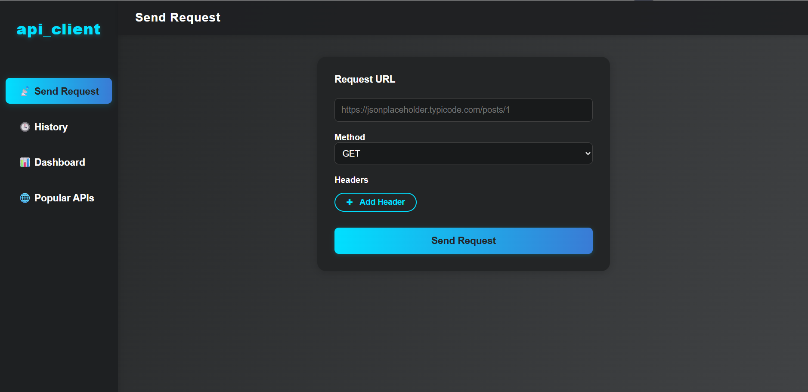
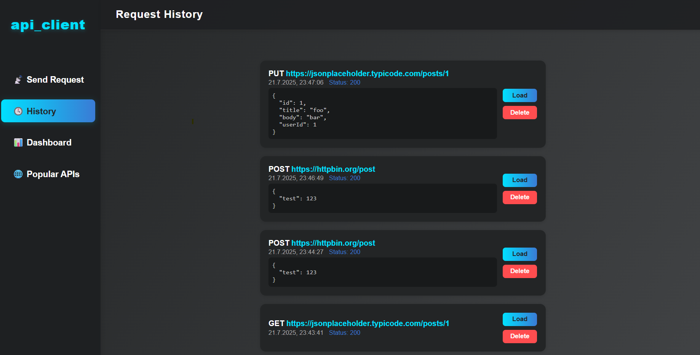
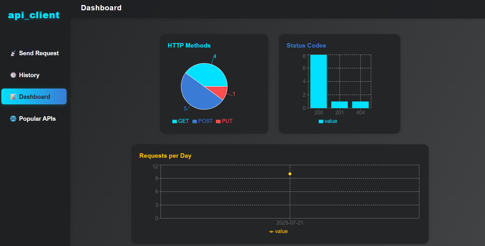
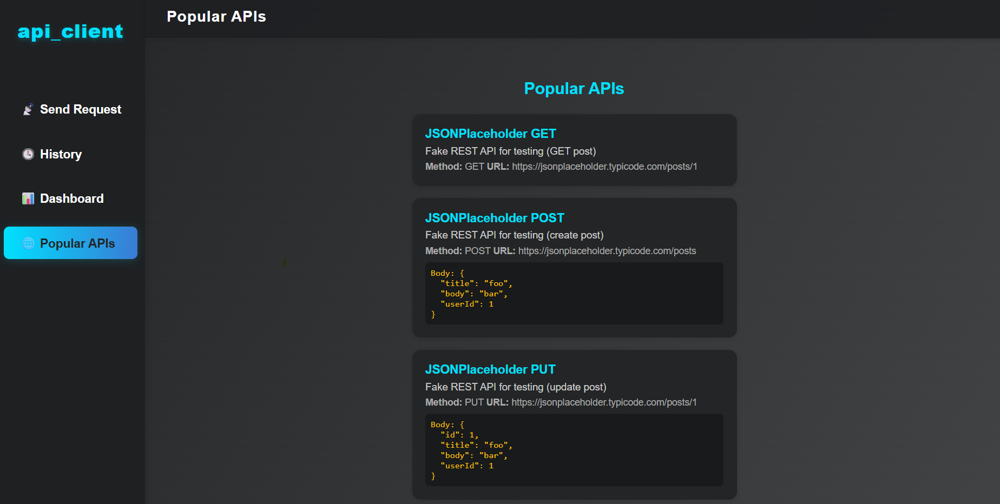

# API Client (Mini Postman)

A modern, cross-platform desktop application for sending HTTP requests, managing request history, and visualizing API usage statistics. Built with **TypeScript**, **React**, and **Electron**.

---

## Application Description
API Client is a lightweight desktop tool inspired by Postman, designed for developers and testers to easily send HTTP requests, manage request history, and visualize API usage. The app features a modern UI, dynamic headers, JSON body support, and a dashboard with charts.

---

## Features
- Clean, intuitive, and responsive UI
- Send GET, POST, PUT, DELETE requests
- Dynamic headers and JSON body support
- Request history (CRUD): save, load, delete
- Data persistence via localStorage
- Dashboard with charts (Recharts)
- Error handling and loading states
- Unit-tested core logic
- Popular API templates for quick testing

---

## Project Structure & Architecture

- `src/main/` – Electron Main Process files (window creation, preload, etc.)
- `src/renderer/` – React/UI code (components, hooks, styles)
  - `styles/` – Component-specific CSS files
  - `api-docs.md` – Internal documentation for modules and types
- `public/` – Static files (index.html)
- `dist/` – Build output and executable files (e.g., exe)
- `screenshots/` – App screenshots for documentation

---

## Build & Run Instructions

**System Requirements:**  
- Windows 10/11 (tested on 10.0.22631)  
- Node.js 18+  
- npm 9+

**Installation:**
```bash
git clone <repo-url>
cd api_client
npm install --legacy-peer-deps
```

**Run in Development:**
```bash
npm run dev
```

**Build Production Executable:**
```bash
npm run dist
```
The Windows executable will be in `dist/win-unpacked/API Client.exe`.

**Note:**  
If you encounter permission errors, run your terminal as administrator ("Run as administrator").

---

## Executable

The Windows executable can be downloaded here:  
[Download API Client.exe (Google Drive)](https://drive.google.com/drive/folders/1D0eME2_44Bhx7p-PaEYamLhIPCIOcGW6?usp=drive_link)

To run the app, download and double-click the executable.  
No installation or environment file is required.  
**If you download the whole folder, do not move the exe file out of its folder – it needs the other files in the same directory.**

If you encounter permission issues, right-click and select "Run as administrator".

---

## Main Modules & Components

- **RequestScreen** – Main form for sending HTTP requests (GET/POST/PUT/DELETE), dynamic headers, JSON body, and result display.
- **HistoryScreen** – Displays request history, with load and delete actions.
- **Dashboard** – Visualizes request statistics (methods, status codes, requests per day) using Recharts.
- **PopularApis** – Shows a list of popular API templates for quick testing.
- **useRequestHistory** – Custom React hook for managing request history in localStorage.
- **HTTP Requests** – Handled via the Fetch API, including headers, body, and error handling.
- **Persistence** – All requests are saved to localStorage (up to 50 most recent).

For more details, see [`src/renderer/api-docs.md`](src/renderer/api-docs.md).

---

## Screenshots

**Send Request**


**Request History**


**Dashboard**


**Popular APIs**


---

## Known Limitations
- No authentication or environment variables support
- CORS limitations may block some public APIs
- Data is stored locally (per device, per user)
- No advanced request scripting (like Postman pre-request scripts)
- No file upload/download support

---

## API Documentation
See [`src/renderer/api-docs.md`](src/renderer/api-docs.md) for documentation of the main modules and types.

---


